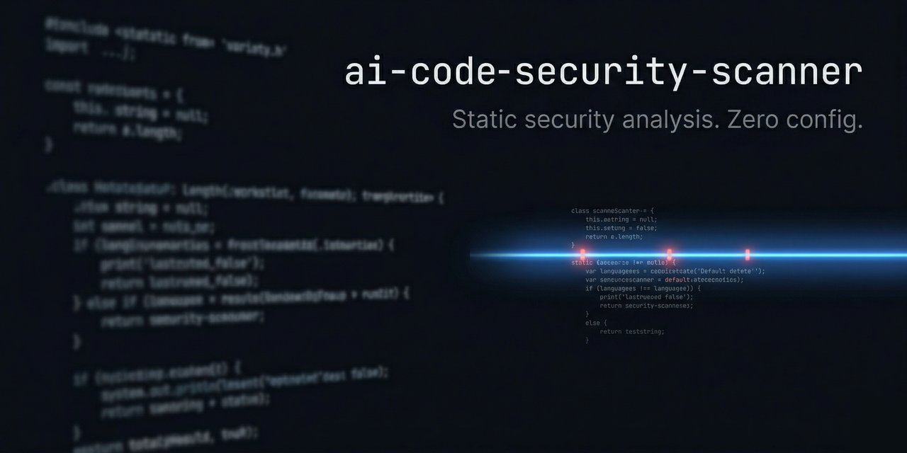

# AI Code Security Scanner



[](https://www.npmjs.com/package/ai-code-security-scanner)
[](https://www.npmjs.com/package/ai-code-security-scanner)
[](LICENSE)
[](https://github.com/astro717/ai-code-security-scanner/actions/workflows/ci.yml)

**Static security analysis for 14 languages — OWASP Top 10, 43+ vulnerability types, zero config.**

Point it at any codebase and get findings in seconds. No accounts, no setup, no configuration files required.

```bash
npx ai-code-security-scanner ./src
```

---

## Why

AI-generated code ships fast — but it reproduces the same security mistakes at scale: SQL injection via f-strings, hardcoded secrets, path traversal from unsanitized inputs. This scanner catches them across every language your stack touches, before they reach production.

---

## Try it instantly

```bash
npx ai-code-security-scanner ./src
```

## Install

```bash
npm install -g ai-code-security-scanner

# Then use the shorter alias:
ai-sec-scan ./src
```

---

## Supported Languages

| Language | Detection | Auto-fix |
|----------|-----------|----------|
| TypeScript / JavaScript | ✓ | ✓ |
| Python | ✓ | ✓ |
| Go | ✓ | ✓ |
| Java | ✓ | ✓ |
| C# | ✓ | ✓ |
| Ruby | ✓ | ✓ |
| PHP | ✓ | ✓ |
| Rust | ✓ | ✓ |
| Swift | ✓ | ✓ |
| Kotlin | ✓ | ✓ |
| C / C++ | ✓ | ✓ |

---

## Usage

### CLI

```bash
# Scan a directory
ai-sec-scan ./src

# Scan a single file
ai-sec-scan src/app.ts

# JSON output
ai-sec-scan ./src --format json

# SARIF 2.1.0 (GitHub Security tab / CI artifacts)
ai-sec-scan ./src --format sarif

# HTML report (open in browser)
ai-sec-scan ./src --format html --output report.html

# Filter by minimum severity
ai-sec-scan ./src --severity high

# Set the severity that triggers a non-zero exit code
ai-sec-scan ./src --min-severity critical

# Apply auto-fixes
ai-sec-scan ./src --fix

# Exclude paths (repeatable)
ai-sec-scan . --ignore '**/node_modules/**' --ignore 'dist/**'

# Watch mode — re-scans on file changes
ai-sec-scan ./src --watch

# Use a config file
ai-sec-scan ./src --config .ai-sec-scan.json
```

#### CLI flags

| Flag | Description |
|------|-------------|
| `[path]` | File or directory to scan. Defaults to `.` |
| `--json` | Output as JSON (shorthand for `--format json`) |
| `--sarif` | Output as SARIF 2.1.0 (shorthand for `--format sarif`) |
| `--format <fmt>` | `text` \| `json` \| `sarif` \| `html` \| `junit` \| `markdown` \| `sonarqube` |
| `--severity <level>` | Minimum severity to include (`critical\|high\|medium\|low`). Default: `low` |
| `--min-severity <level>` | Severity that triggers a non-zero exit code. Default: `high` |
| `--fix` | Apply safe auto-fixes for supported finding types |
| `--output <path>` | Write output to a file instead of stdout |
| `--ignore <glob>` | Exclude matching paths (repeatable) |
| `--config <path>` | Path to a `.ai-sec-scan.json` config file |
| `--watch` | Watch for file changes and print a live diff of findings |

#### Config file (`.ai-sec-scan.json`)

Place a `.ai-sec-scan.json` in your project root (or pass `--config`):

```json
{
  "severity": "medium",
  "format": "sarif",
  "fix": true,
  "ignore": ["dist/**", "**/*.test.ts", "**/*.spec.ts"]
}
```

| Key | Type | Description |
|-----|------|-------------|
| `severity` | `string` | Minimum severity to include (`critical` \| `high` \| `medium` \| `low`). Default: `low` |
| `format` | `string` | Output format. Default: `text` |
| `fix` | `boolean` | Apply auto-fixes on every run. Default: `false` |
| `ignore` | `string[]` | Glob patterns to exclude (merged with `--ignore` flags) |

CLI flags override config file values.

#### Ignore file (`.aiscanner`)

Create a `.aiscanner` file in your project root (gitignore-style):

```
# ignore generated files
dist/**
coverage/**
**/*.min.js
```

---

### API Server

```bash
# Start the server
ai-sec-scan server

# Health check
curl http://localhost:3001/health

# Scan a code snippet
curl -X POST http://localhost:3001/scan \
  -H "Content-Type: application/json" \
  -d '{"code": "const password = \"hunter2\""}'

# With AI explanations (requires ANTHROPIC_API_KEY)
curl -X POST http://localhost:3001/scan \
  -H "Content-Type: application/json" \
  -d '{"code": "eval(userInput);", "aiExplain": true}'
```

#### Authentication

Set `SERVER_API_KEY` to require a Bearer token on all requests (except `/health`):

```bash
export SERVER_API_KEY=my-secret-key

curl -X POST http://localhost:3001/scan \
  -H "Authorization: Bearer $SERVER_API_KEY" \
  -H "Content-Type: application/json" \
  -d '{"code": "const pw = \"hunter2\""}'
```

---

### CI Integration

Add to any GitHub Actions workflow:

```yaml
# .github/workflows/security-scan.yml
name: Security Scan
on: [push, pull_request]
jobs:
  scan:
    runs-on: ubuntu-latest
    steps:
      - uses: actions/checkout@v4
      - uses: actions/setup-node@v4
        with:
          node-version: '20'
      - run: npx ai-code-security-scanner ./src --format sarif --min-severity high
      - uses: github/codeql-action/upload-sarif@v3
        with:
          sarif_file: output.sarif
        if: always()
```

Or use the reusable workflow:

```yaml
jobs:
  security:
    uses: astro717/ai-code-security-scanner/.github/workflows/security-scan.yml@v1
    with:
      path: src/
      fail-on: high
```

---

### VS Code Extension

Install from the [VS Code Marketplace](https://marketplace.visualstudio.com/items?itemName=rouco-industries.ai-code-security-scanner) — scans on every file save and shows inline diagnostics.

**Settings** (`File → Preferences → Settings → AI Code Security Scanner`):

| Setting | Default | Description |
|---------|---------|-------------|
| `aiSecScan.serverUrl` | `http://localhost:3001` | Scanner server URL |
| `aiSecScan.apiKey` | `""` | Bearer token for authenticated servers |
| `aiSecScan.autoScanOnSave` | `true` | Scan active file on save |

---

## Detectors

43+ finding types covering the full [OWASP Top 10 2021](https://owasp.org/Top10/):

| Finding type | Severity | Languages |
|-------------|----------|-----------|
| `SECRET_HARDCODED` | critical | all |
| `SQL_INJECTION` | critical | JS/TS, Python, Go, Java, Ruby, PHP |
| `SQL_INJECTION_CS` | critical | C# |
| `XSS` | critical | JS/TS, PHP |
| `SSTI` | critical | Python |
| `COMMAND_INJECTION` | high | JS/TS |
| `COMMAND_INJECTION_C` | critical | C/C++ |
| `COMMAND_INJECTION_CS` | critical | C# |
| `COMMAND_INJECTION_GO` | high | Go |
| `SHELL_INJECTION` | high | JS/TS |
| `EVAL_INJECTION` | high | JS/TS, Python |
| `PATH_TRAVERSAL` | high | JS/TS, Python, Go |
| `PATH_TRAVERSAL_CS` | high | C# |
| `PROTOTYPE_POLLUTION` | high | JS/TS |
| `SSRF` | high | JS/TS, Python, Go, C# |
| `OPEN_REDIRECT` | medium | JS/TS, C# |
| `CORS_MISCONFIGURATION` | high | JS/TS |
| `JWT_HARDCODED_SECRET` | critical | JS/TS |
| `JWT_WEAK_SECRET` | high | JS/TS |
| `JWT_NONE_ALGORITHM` | high | JS/TS |
| `JWT_DECODE_NO_VERIFY` | high | JS/TS |
| `CSRF` | high | JS/TS |
| `MISSING_AUTH` | high | Python, Go, C# |
| `INSECURE_RANDOM` | medium | JS/TS, Python, C# |
| `WEAK_CRYPTO` | medium | JS/TS, Python, C#, Rust |
| `UNSAFE_DESERIALIZATION` | critical | Python, C#, Rust |
| `INSECURE_ASSERT` | medium | Python |
| `INSECURE_BINDING` | medium | Python, Go |
| `XML_INJECTION` | high | Python, Java |
| `LDAP_INJECTION` | high | Python, Java |
| `BUFFER_OVERFLOW` | critical | C/C++, Rust |
| `FORMAT_STRING` | critical | C/C++ |
| `UNSAFE_BLOCK` | medium | C#, Rust |
| `MASS_ASSIGNMENT` | high | Ruby |
| `REDOS` | medium | JS/TS |
| `INSECURE_SHARED_PREFS` | medium | Kotlin |
| `WEBVIEW_LOAD_URL` | high | Kotlin |
| `FORCE_UNWRAP` | medium | Swift |
| `FORCE_TRY` | medium | Swift |
| `PERFORMANCE_N_PLUS_ONE` | medium | C#, Kotlin |
| `UNSAFE_DEPENDENCY` | medium | JS/TS |
| `VULNERABLE_DEPENDENCY` | critical–medium | JS/TS |

---

## Environment variables

| Variable | Description |
|----------|-------------|
| `SERVER_API_KEY` | Bearer token for API server auth. If unset, server runs in open-access mode. |
| `ANTHROPIC_API_KEY` | Enables AI-powered explanations and fix suggestions via `aiExplain: true`. |
| `VITE_SCANNER_URL` | Web UI only — overrides the default scanner server URL (`http://localhost:3001`). |
| `MAX_CACHE_ENTRIES` | Max number of files to keep in the scan cache. Default: `10000`. |

---

## Tests

```bash
npm run test:vitest          # Run all 867 tests
npm run test:vitest:server   # Server integration tests only
npm run test:coverage        # Run with coverage report
```

---

## Contributing

See [CONTRIBUTING.md](CONTRIBUTING.md) for dev setup, project structure, and guidelines for adding new detectors or languages.

---

## License

[MIT](LICENSE)
